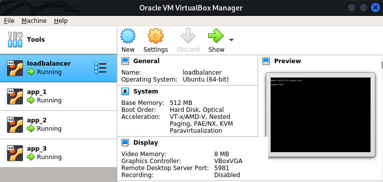
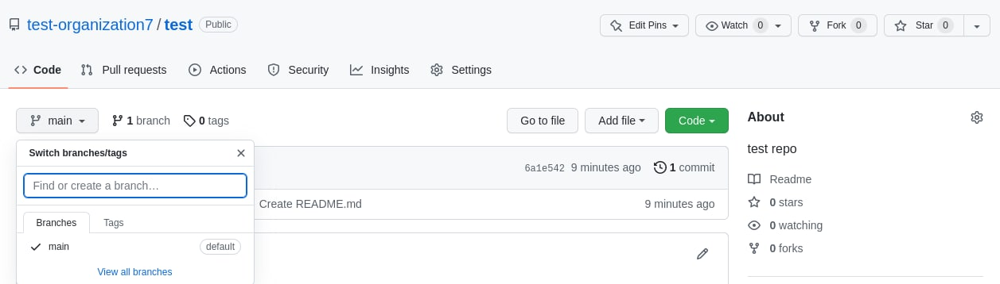
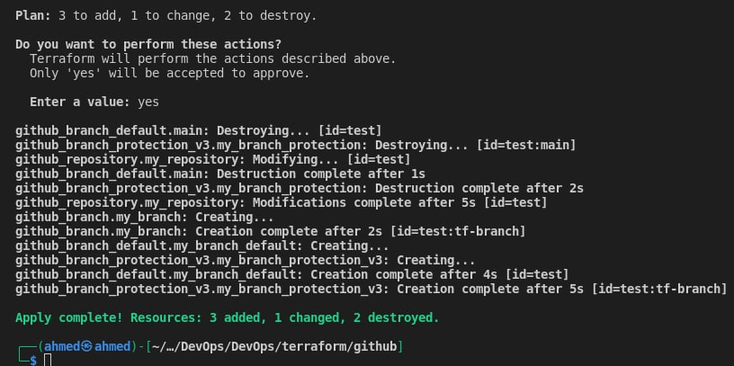
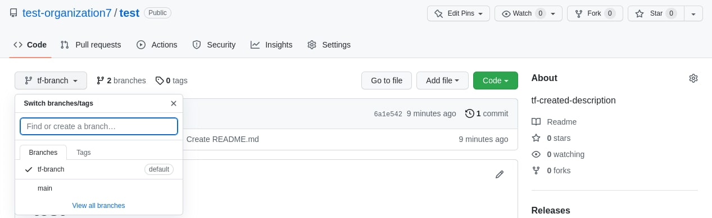
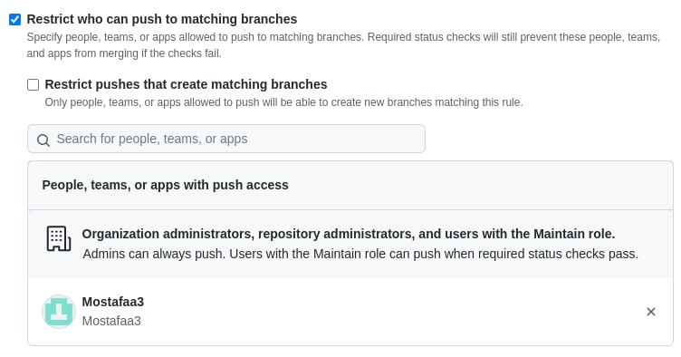

# Infrastructure as Code

## Table of Contents

1. [Overview](#1.-Overview)

   1.1. [Terraform](#1.1.-Terraform)

   1.2. [Vagrant](#1.2.-Vagrant)

2. [Goal](#2.-Goal)

3. [Steps](#3.-Steps)

   3.1. [Prerequisites](#3.1.-Prerequisites)

   3.2. [Vagrant](#3.2.-Vagrant)

   3.3. [GitHub](#3.3-GitHub)

   ​	3.3.1. [Screenshots](#3.3.1.-Screenshots)

4. [Best Practices](#4.-Best-Practices)

## 1. Overview

### 1.1. Terraform

The core terraform workflow consists of 3 stages:

- **Write:** represent infrastructure as [HCL declarative code](https://www.terraform.io/language). The syntax is built around two constructs: **arguments** and **blocks** (i.e., line-separated arguments and blocks).
  - HCL supports common programming concepts such as **variables**, **types** (string, numeric), **functions** (built-in), and **expressions**.
  - An existing and supported infrastructure can be **import**ed into terraform to start managing it from code.
- **Plan:** terraform creates an execution plan describing actions (e.g., create, modify, or destroy resources) that will be taken based on existing infrastructure **state** (stored in the **backend**) and current **workspace** configuration.
- **Apply:** interact with the service/platform-specific API through their **providers** (published on [**registry**](https://registry.terraform.io/)) to execute the plan.
  - **Named values** are used for working with API keys or other configurations to allow re-usability and avoid hard-coding.
  - **Modules** are used to group resources that are used together as a reusable package. 


### 1.2. Vagrant

- `Vagrantfile` is used to describe a **virtual environment** (of **VMs/containers** with networking) as **declarative ruby code** that can be used to set **up** the environment, test scripts or configuration management tools (e.g., Chef, Ansible, or Puppet), then **halt** and **destroy** the environment or recreate it on the cloud.
- A **box** (pulled from the **[cloud](https://vagrantcloud.com/boxes/search)**) is typically used as the starting point for running ready-to-use environments or as a template for creating custom ones.
- **Providers** allow writing `Vagrantfile`s for different types of virtualization systems. Support for **Virtualbox**, **Hyper-V**, and **Docker** works out-of-the-box. Other providers should be installed as **plugins**.

## 2. Goal

Getting familiar with terraform by:

- Using Vagrant provider to provision a test infrastructure (3 VMs).
- Using GitHub provider to manage a GitHub repository from code.

## 3. Steps

### 3.1. Prerequisites

- Install [VirtualBox](https://www.virtualbox.org/wiki/Downloads), [Terraform CLI](https://www.terraform.io/downloads), and [Vagrant CLI](https://www.vagrantup.com/downloads)
- Create `terraform` directory with 2 subdirectories (modules) for `vagrant` and `github`

### 3.2. Vagrant

- Write `Vagrantfile` that uses [hashicorp/bionic64](hashicorp/bionic64) box for creating 3 VMs.
  
  ```bash
  vagrant up       # Start and provision environment
  vagrant halt     # Stop the VMs
  vagrant destroy  # Destroy the environment.
  ```

- On success, 3 VMs should be visible in VirtualBox GUI.
  - **Default credentials:** vagrant:vagrant
  - Information about forwarded ports and how to SSH into the machines are found in the output of `vagrant up` and can be customized from code.

  
  
- Write `main.tf` that uses vagrant provider to achieve the same result

  ```bash
  terraform init      # Prepare workspace
  terraform validate  # Check configuration for validity
  terraform fmt       # Format source file
  terraform plan      # Show execution plan
  terraform apply     # Execute the plan
  terraform destroy   # Destroy created infrastructure
  ```

### 3.3. GitHub

- Write `main.tf` that uses `integrations/github` provider.
- Configure `github` provider with `token` declared in `variables.tf` and assign the value from command line or `.tfvars` file.
- Declare resources of types `github_repository`, `github_branch`, `github_branch_default`, and `github_branch_protection_v3`  with the desired configurations.
- Import the remote repo to use the existing configuration
  
  ```bash
  terraform import github_repository.<resource_name> <repo_name>
  ```

- Use the same terraform commands as above to manage the repository configuration from terraform.

#### 3.3.1. Screenshots

- **Test repository created manually**

  

- **Terraform configurations applied**

  

- **Description and default branch changed**

  

- **Branch protection rules applied**

  

## 4. Best Practices

- Use an IDE plugin to help with syntax highlighting and autocompletion ([official VSCode plugin](https://marketplace.visualstudio.com/items?itemName=HashiCorp.terraform)).
- Use built-in formatter and validator, check plan before applying changes.
- Sensitive information (state and secret variables) shouldn’t be pushed to the VCS; they can be stored locally and ignored by the VCS, or stored remotely and encrypted at rest ([.gitignore for terraform](https://github.com/github/gitignore/blob/main/Terraform.gitignore)).
- Recommended directory structure and file naming for a minimal module:

  ```bash
  .
  ├── README.md     # module description
  ├── main.tf       # entry point (resource definition)
  ├── variables.tf  # input variables and locals
  ├── outputs.tf    # output variables
  ```

- When using providers (for vagrant or terraform), be sure to pin their versions to ensure reproducibility.
