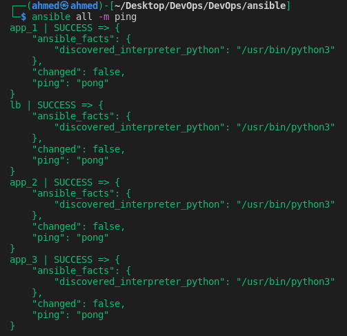
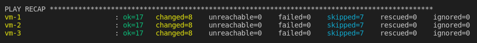
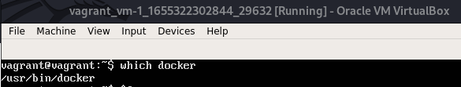

# Continuous Deployment

## Table of Contents

1. [Overview](#1-Overview)

   1.1. [Ansible](#1.1.-Ansible)

2. [Goal](#2-Goal)

3. [Steps](#3-Steps)

   3.1. [Prerequisites](#3.1-Prerequisites)

   3.2. [Create Ansible Roles](#3.2.-Create-Ansible-Roles)

4. [Best Practices](#4.-Best-Practices)

## 1. Overview

### 1.1. Ansible

- A **playbook** (written in YAML) defines one or more **plays** that will be executed on one or more remote machines (selected from **inventory**) through an SSH connection (no agent required).
- A **play** has a **name** (optional), **vars** (optional), target **hosts** (selected by **patterns**), a **remote_user** (e.g., root), one or more **tasks** to execute, and (optionally) one or more **handlers** to be **notified** to run when the play changes machine **state**.
- A task executes a [named] **module** (**[built-in](https://docs.ansible.com/ansible/2.9/modules/modules_by_category.html)** or [**3rd-party**](https://galaxy.ansible.com/)) against remote machines (default execution **strategy** is sequential).
- An **inventory** (YAML/INI file) contains [named groups of] IP addresses or hostnames of remote machines, it can also store **variables**.
- Ansible collects **return codes** from executed tasks, **facts** about remote machines and **magic variables** storing internal state.
- **Role:** the standard way to group related Ansible artifacts (vars, files, tasks, etc.) to share them so they can be loaded and reused.

## 2. Goal

- Getting familiar with Ansible by writing plays to automatically install docker and deploy one of the applications on the Vagrant VMs created during the previous phase. 

## 3. Steps

### 3.1. Prerequisites

- [Install Ansible CLI](https://docs.ansible.com/ansible/latest/installation_guide/intro_installation.html)

- Apply terraform plan with vagrant provider from previous phase.

  ```bash
  cd terraform/vagrant
  terraform apply
  ```

- Forwarded SSH ports will be printed, note them down to use in Ansible config.

- Create inventory (`ansible/hosts`) with configurations for connecting to VMs.

- Specify `ansible_ssh_private_key_file=<key_file>` in inventory.

  - Key files can be found in `.vagrant` directory which should be ignored from the VCS.

- Create project configuration (`ansible/ansible.cfg`) and override inventory file location to use the one just created.

  - You may also disable `host_key_checking` as it requires interactive input to add VMs to `~/.ssh/known_hosts`.

- Test connection with `ping` module

  

- Install [community.docker collection](https://galaxy.ansible.com/community/docker)

  ```
  ansible-galaxy collection install community.docker
  ```

### 3.2. Create Ansible Roles

- Create 3 roles inside `ansible/roles` directory for:

  - Installing nginx on the loadbalancer VM with a given `nginx.conf`.
  - Installing docker on `app` VMs specified in `hosts` file.
  - Deploying application image with a given `dockerhub_id` and `app_name`

- Test the roles: `ansible-playbook site.yml`

  

- Verify that docker is installed and application image is running

  

- Verify that app is running on http://localhost:8080

- You may also schedule [Watchtower](https://github.com/containrrr/watchtower) to automatically update app images from DockerHub.

## 4. Best Practices

https://docs.ansible.com/ansible/latest/user_guide/playbooks_best_practices.html

- A module should be responsible for one small simple task.

- Use the recommended [directory structure](https://docs.ansible.com/ansible/latest/user_guide/playbooks_reuse_roles.html#role-directory-structure) for roles.

- Use `ansible-playbook --check` to check actions before taking them (not all modules support this).

  - Or try changes on staging environment first.

- Give tasks meaningful names, separate them with empty lines for readability, use comments for extra explanation.

- Use `ansible-lint` to lint playbooks.

- Use dynamic inventory when working with cloud hosts to avoid manual IP/hostname configurations.

- Use `state` to specify the desired module state so that modules won’t execute twice unless needed.

  
