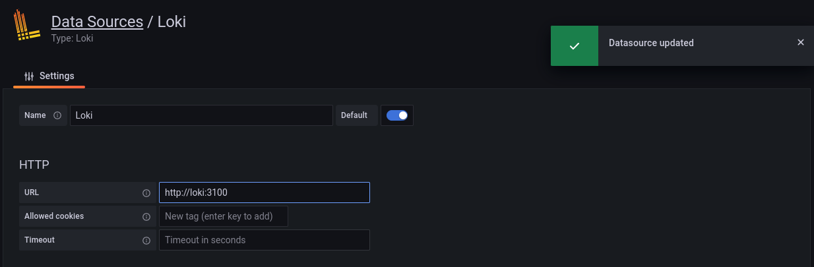
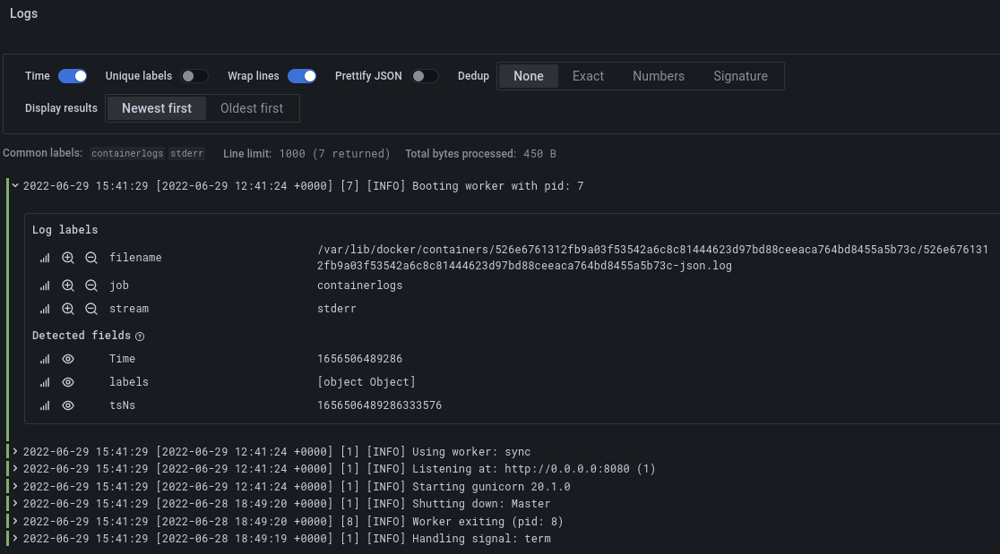
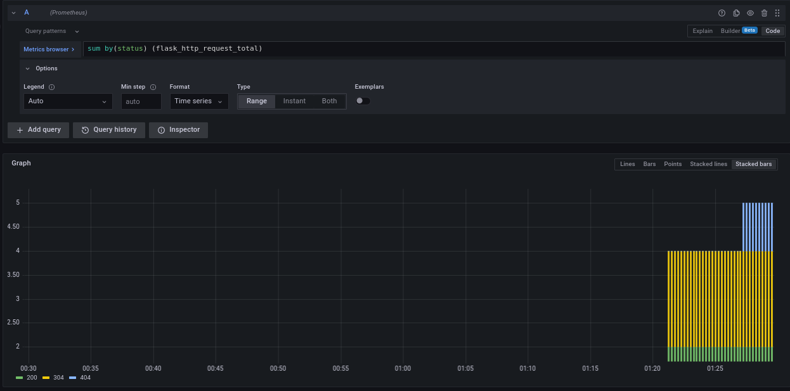
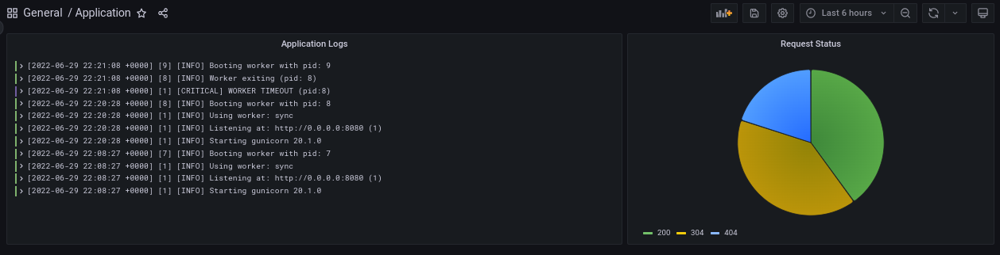

# Logging, Monitoring, and Visualization

## Table of Contents

1. [Overview](#1-Overview)

   1.1. [Prometheus](#1.1.-Prometheus)

   1.2. [Grafana](#1.2.-Grafana)

   1.3. [Grafana Loki](#1.3.-Grafana-Loki)

2. [Goal](#2-Goal)

3. [Steps](#3-Steps)

   3.1. [Logging](#3.1-Logging)

   3.2. [Exporting Metrics](#3.2.-Exporting-Metrics)

   3.3. [Preparing Environment](#3.3.-Preparing-Environment)

   3.4. [Demo](#3.4.-Demo)

4. [Best Practices](#4.-Best-Practices)

## 1. Overview

### 1.1. Prometheus

- A monitoring system that pulls (retrieves) **metrics** data (entries of [types](https://prometheus.io/docs/concepts/metric_types/) **counter**, **gauge**, **histogram**, and **summary**) by running a **job** against one or more **instances** and stores these data in a **time-series** database.
- **[Client libraries](https://prometheus.io/docs/instrumenting/clientlibs/)** written in different programming languages can be used to export application metrics while [**exporters**](https://prometheus.io/docs/instrumenting/exporters/) export metrics data from different systems (e.g., a Linux server or a database).
- Metrics database can be queried (using **PromQL**) manually through the web UI or automatically by a visualization and analytics system (e.g., Grafana) or used to configure **alerting rules** that are handled by the **alert manager**.

### 1.2. Grafana

- A web application used mainly for visualization and analytics. Once deployed (e.g., as a docker image), it provides a nice UI for creating and customizing **dashboards** with **panels** (containing **graphs**, **bars**, **gauges**, **charts**, etc.) to visualize **metrics** or **logs** collected by a **monitoring** solution (e.g., **Prometheus** or **Grafana Loki**) from different systems or databases.
- It can be used to configure **alerts** and has a **[plugin](https://grafana.com/grafana/plugins/)** system to extend its functionality and integrate with other tools.

### 1.3. Grafana Loki

- A monitoring solution like Prometheus, but focused on application **logs** (collected by **[clients](https://grafana.com/docs/loki/latest/clients/)**) instead of general metrics.
- Logs are stored as compressed objects and indexed for high efficiency, they can be queried using **LogQL**.

## 2. Goal

- Prepare a monitoring and visualization environment for the apps as a network of containers (application + Grafana + Prometheus + Loki with Promtail client).
- Configure Loki to monitor logs from all running containers and Prometheus to monitor metrics of itself, Loki, and the application.
- Create a Grafana dashboard to visualize the scraped data.

## 3. Steps

### 3.1. Logging

- Make sure the application generates logs that can be accessed when running the container.
- (Optional) write code to generate application-specific logs:
  - **Python App:** Flask provides `Flask.Logger` which is a standard [`logging`.Logger](https://docs.python.org/3/library/logging.html#logging.Logger)  
  - **NodeJS App:** `console` utilities for `debug`, `warn`, and `error` can be used.
    - 3rd party libraries such as [Winston](https://www.npmjs.com/package/winston) are commonly used for better logging.
    - ExpressJS also provides [morgan](https://expressjs.com/en/resources/middleware/morgan.html) middleware for logging requests.

### 3.2. Exporting Metrics

- An HTTP endpoint for application metrics need to be exposed by the application for scraping by Prometheus.
- We can define our own metrics and export them using [client libraries for Python and NodeJS](https://prometheus.io/docs/instrumenting/clientlibs/), or use 3rd party exporters like [prometheus-flask-exporter](https://github.com/rycus86/prometheus_flask_exporter) for Python app and [swagger-stats](https://github.com/slanatech/swagger-stats) for NodeJS app.

### 3.3. Preparing Environment

- Write a `docker-compose.yml` for deploying the application with the logging and monitoring stack in a single network [[ref.](https://github.com/grafana/loki/blob/main/production/docker-compose.yaml)].
- Write configuration files for Loki [[ref.](https://grafana.com/docs/loki/latest/configuration/examples/)], Promtail [[ref.](https://grafana.com/docs/loki/latest/clients/promtail/configuration/)], and Prometheus [[ref.](https://github.com/prometheus/prometheus/blob/main/documentation/examples/prometheus.yml)] and copy them to containers or use a volume.
  - **Loki configuration** specifies internal settings for Loki server and where to store logs (locally or remotely).
  - **Promtail configuration** contains information on the Promtail server, where positions are stored, and how to scrape logs from files.
  - **Prometheus configuration** defines target endpoints to scrape and how often to scrape them.
- Run the 3 containers with a `command` that specifies config file location.

### 3.4. Demo

- Run `docker-compose up` and verify that all containers are running.

- Verify the application is running at http://locaohost:8080 

- Verify Prometheus UI is accessible at http://locaohost:9090 and all targets are up in status tab, you can also run queries with autocompletion.

  

- Verify Grafana UI is accessible at http://localhost:3000

  - Default credentials: `admin:admin`

- Configuration &rarr; Data source &rarr; Add data source

  - &rarr; Loki &rarr; URL = `http://loki:3100` &rarr; Save and test.

  - &rarr; Prometheus &rarr; URL = `http://prometheus:9090` &rarr; Save and test.
    - We can also add built-in Prometheus stats dashboard.

- Explore &rarr; Loki &rarr; Add query &rarr; Write PromQL query or use UI builder.

  - Example query that shows application logs `{tag="monitoring_app_1"}`

    

- Explore &rarr; Loki &rarr; Add query &rarr; Write PromQL query or use UI builder.

  - Example query showing endpoint responses: `sum by(status) (flask_http_request_total)`

    

- Now we can create interesting dashboards from data collected by Prometheus and Loki and export them as reusable JSON.

  

## 4. Best Practices

- Official guides: [Grafana](https://grafana.com/docs/grafana/latest/best-practices/), [Loki](https://grafana.com/docs/loki/latest/best-practices/), [Prometheus](https://prometheus.io/docs/practices/).
- Create descriptive logs that follow a common format.
- Implement log rotation to save memory and disk space.
- Create simple, easy to interpret dashboards with meaningful names.
- When configuring alerts, try to have them triggered only when attention is needed.
- Avoid unnecessary dashboard reloading to reduce network load.
- Metric names for Prometheus should have a (single-word) application prefix relevant to the domain the metric belongs to.

