# Container Orchestration

## Table of Contents

1. [Overview](#1-Overview)

   1.1. [Kubernetes](#11-Kubernetes)

    1.1.1. [Overview](#111-Overview)

    1.1.2. [Common API Resources](#112-Common-API-Resources)

    1.1.3. [Highlighted Properties](#113-Highlighted-Properties)

   1.2. [Helm](#12-Helm)

2. [Goals](#2-Goals)

3. [Steps](#3-Steps)

   3.1. [Creating a Deployment](#31-Creating-a-Deployment)

   3.2. [Writing Helm Charts](#32-Writing-Helm-Charts)

   3.3. [Secret Management](#33-Secret-Management)

   3.4. [Resource Restrictions](#34-Resource-Restrictions)

   3.5. [Application Configuration](#35-Application-Configuration)

   3.6. [Managing Stateful Apps](#36-Managing-Stateful-Apps)

   3.7. [Using Init-Containers](#37-Using-Init-Containers)

   3.8. [Deploying Community Charts](#38-Deploying-Community-Charts)

4. [Best Practices](#4-Best-Practices)

## 1. Overview

### 1.1. Kubernetes

#### 1.1.1. Overview

- Kubernetes is a system for automating software deployment, scaling, and management.
- A typical use case involves the deployment of different **[objects](https://kubernetes.io/docs/concepts/overview/working-with-objects/kubernetes-objects/)** (expressed as YAML files describing the desired object **spec**ification) on **nodes** (virtual or physical machines) inside the **cluster** that is **controlled** and **managed** by the **master node** which stores information about the cluster state in **etcd** database and exposes an **API** that can be interacted with from the command-line using `kubectl`.

#### 1.1.2. Common API Resources

- Common object **kind**s (check `kubectl api-resources`)

  | Object                                                       | Overview                                                     |
  | ------------------------------------------------------------ | ------------------------------------------------------------ |
  | [**Pod**](https://kubernetes.io/docs/concepts/workloads/pods/) | Represents a logical host that typically runs one containerized application, but may run additional **[sidecar](https://kubernetes.io/docs/concepts/workloads/pods/#workload-resources-for-managing-pods)** containers. |
  | [**ReplicaSet**](https://kubernetes.io/docs/concepts/workloads/controllers/replicaset/) | Ensures that a specified number of pod replicas are running at one time. |
  | [**Deployment**](https://kubernetes.io/docs/concepts/workloads/controllers/deployment/) | Represents an application running in the cluster, provides declarative updates for Pods and ReplicaSets. |
  | [**Service**](https://kubernetes.io/docs/concepts/services-networking/service/) | Represents a network service that makes a set of pods accessible using a single DNS name and can load-balance between them. |
  | [**ConfigMap**](https://kubernetes.io/docs/concepts/configuration/configmap/) | An API object used to store non-confidential  data as key-value pairs that are accessible by pods (e.g., as environment variables). |
  | [**Secret**](https://kubernetes.io/docs/concepts/configuration/secret/) | Similar to ConfigMaps, but are specifically intended to hold confidential data (e.g., passwords and tokens). |
  | [**Ingress**](https://kubernetes.io/docs/concepts/services-networking/ingress/) | An API object that manages external access to the services in a cluster, typically HTTP. |
  | **[StatefulSet](https://kubernetes.io/docs/concepts/workloads/controllers/statefulset/)** | A deployment for stateful applications; provides guarantees about the ordering and uniqueness of deployed Pods. |
  | **[DaemonSet](https://kubernetes.io/docs/concepts/workloads/controllers/daemonset/)** | DaemonSet ensures that a copy of a certain pod (e.g., logs collector, metrics exporter, etc) is available on every node in the cluster. |
  | **[PersistentVolume](https://kubernetes.io/docs/concepts/storage/persistent-volumes/)** | Abstraction of a persistent storage that can use a local or remote (cloud) storage as a backend. Pods can acquire portions of that storage using a PersistentVolumeClaim |
  | **[LimitRange](https://kubernetes.io/docs/concepts/policy/limit-range/)** | Enforces minimum and maximum resource usage limits per pod or container in a namespace. |

#### 1.1.3. Highlighted Properties

- **`Service.spec.type`** [[ref.](https://kubernetes.io/docs/concepts/services-networking/service/#publishing-services-service-types)]
  - **`ClusterIP` (default):** exposes the service only internally by giving it a cluster-internal IP.
    - **Headless Service:** a ClusterIP service with `.spec.ClusterIP: "None"`. It is typically used with a StatefulSet to make pods addressable by a hostname as it’s needed to maintain pod identity.

  - **`NodePort`:** expose the service on each Node's IP at a static port (`.spec.ports[*].nodePort`)
  - **`LoadBalancer`:** creates a provider-specific load balancer between pods selected by the service.
  - **`ExternalName`:** creates a CNAME DNS record for the service with name `.spec.externalName`.  

- **`Pod.spec.strategy.type`** (how k8s replaces old pods with new ones)
  - **`RollingUpdate` (default):** creates extra pods (not more than `.spec.strategy.rollingUpdate.maxSurge`) to replace old (terminating) ones while not exceeding a `maxUnavailable` number/percentage of running pods.  
  - **`Recreate`:** fully terminate old pods before starting new ones, implies downtime.

- **`Pod.spec.nodeSelector`**
  - Pods can be assigned to any node in a cluster, a `nodeSelector` restricts a certain pod to only run on nodes having certain labels assigned to certain values.
- **`Pod.spec.affinity.nodeAffinity`** and **`Pod.spec.tolerations`**
  - Node affinity expands the concept of nodeSelector to match based on constraints other than labels (e.g., this pod can only run on nodes in this geographical location).
  - Tolerations specify whether a certain pod tolerate a certain node taint.
    - Node taints are rules attached to a node (e.g., this node has a certain hardware, any pod that does not tolerate this hardware shall not be scheduled on that node).
    - Taints can be added to nodes using `kubectl taint`

- **`Pod.spec.affinity.podAffinity`** and **`Pod.spec.affinity.podAntiAffinity`**
  - Sets affinity constraints based on pod properties instead of node properties.

### 1.2. Helm

- **A package manager for k8s:** allows packaging and reusing an existing k8s architecture/manifest as a bundle of YAML files called an **Application Chart** and upload it to a public/private registry (e.g., [ArtifactHub](https://artifacthub.io/)).

  - **Library charts** on the other hand are not meant for deployment, they are typically included as dependencies to other charts to allow reusing snippets of code across charts and avoid duplication.

- **A templating engine:** the packaged YAML files can use the [Helm templating language](https://helm.sh/docs/chart_template_guide/) that can generate different k8s manifests from the same source file through [values files](https://helm.sh/docs/chart_template_guide/values_files/).  

- **Basic Directory structure of a helm chart:**

  ```bash
  mychart/
    templates/   # YAML bundle (where .Values object is accissble)
    charts/      # Chart dependencies
    Chart.yaml   # Chart metadata: name, version, dependencies, etc.
    values.yaml  # Default values for the template files
  ```

## 2. Goals

1. Deploy an application in minikube using the command line and using a manifest.

2. Create a helm chart from the previously-created manifest.

3. Create a secret (e.g., for DB username and password) and inject it as an environment variable to the deployment pods.  

4. Set LimitRanges for CPU and memory usage on pods.

5. Create a ConfigMap with some JSON data and mount it as a volume.

6. Modify applications so that they do something persistent, and create a StatefulSet to manage their state.

7. Use an init-container to download a file and inject it into an application container.

8. Deploy [Kube-Prometheus-Stack](https://github.com/prometheus-community/helm-charts/tree/main/charts/kube-prometheus-stack) to monitor k8s and manage alerts.

## 3. Steps

### 3.1. Creating a Deployment

- Install [kubectl](https://kubernetes.io/docs/tasks/tools/) and [minikube](https://minikube.sigs.k8s.io/docs/start/)

- Run `minikube start` to start a local k8s cluster and configure `kubectl` to interact with it.

- Create a deployment for the Python (or NodeJS) application.

  ```bash
  kubectl create deployment python-app --image=sh3b0/app_python
  ```

- Create an external service to make the app accessible from outside.

  ```bash
  kubectl expose deployment python-app --type=LoadBalancer --port=8080
  ```

- Show created objects

  ```bash
  $ kubectl get all # or kubectl get pod,svc to show only pods and services
  NAME                             READY   STATUS    RESTARTS   AGE
  pod/python-app-cc8f9dc84-rvkmb   1/1     Running   0          9m28s
  
  NAME                 TYPE           CLUSTER-IP     EXTERNAL-IP   PORT(S)          AGE
  service/kubernetes   ClusterIP      10.96.0.1      <none>        443/TCP          13d
  service/python-app   LoadBalancer   10.108.44.57   <pending>     8080:31302/TCP   6m29s
  
  NAME                         READY   UP-TO-DATE   AVAILABLE   AGE
  deployment.apps/python-app   1/1     1            1           9m28s
  
  NAME                                   DESIRED   CURRENT   READY   AGE
  replicaset.apps/python-app-cc8f9dc84   1         1         1       9m28s
  ```

- When deploying on cloud, an external IP for the service will be available. For testing with minikube, run the following command to get a URL for accessing the service.  

  ```bash
  minikube service python-app --url
  ```

- Remove created objects

  ```bash
  kubectl delete service/python-app
  kubectl delete deployment.apps/python-app
  ```

- Create [deployment.yaml](../k8s/minikube/deployment.yaml) and [service.yaml](../k8s/minikube/service.yaml) inside `k8s/minikube` directory to do the same from configuration files instead of stdin.

- Apply configuration and check results

  ```bash
  $ kubectl apply -f deployment.yaml -f service.yaml
  deployment.apps/app-deployment created
  service/app created
  
  $ kubectl get all
  NAME                                  READY   STATUS    RESTARTS   AGE
  pod/app-deployment-69cfdc7ff9-lkhpk   1/1     Running   0          9s
  pod/app-deployment-69cfdc7ff9-v287x   1/1     Running   0          9s
  pod/app-deployment-69cfdc7ff9-vshs6   1/1     Running   0          9s
  
  NAME                 TYPE           CLUSTER-IP       EXTERNAL-IP   PORT(S)          AGE
  service/app          LoadBalancer   10.106.183.183   <pending>     8080:32442/TCP   12s
  service/kubernetes   ClusterIP      10.96.0.1        <none>        443/TCP          13d
  
  NAME                             READY   UP-TO-DATE   AVAILABLE   AGE
  deployment.apps/app-deployment   3/3     3            3           9s
  
  NAME                                        DESIRED   CURRENT   READY   AGE
  replicaset.apps/app-deployment-69cfdc7ff9   3         3         3       9s
  ```

### 3.2. Writing Helm Charts

- Install [helm](https://helm.sh/docs/intro/install/) and navigate to `k8s/helm`

- Create chart files and directories manually or use `helm create app-deployment` to add some boilerplate.

- Copy the previously-created YAMLs to `templates` directory, parametrize them and put default values in [values.yaml](../k8s/helm/app-deployment/values.yaml)

- **Example use case:** deploy nodejs app for the chart

  ```bash
  cd k8s/helm
  helm install --set image=sh3b0/app_nodejs:latest my-chart ./app-deployment
  
  helm list            # to see installed charts
  minikube dashboard   # opens a web UI for debugging
  ```

### 3.3. Secret Management

- To store secrets (e.g., database user and password) in k8s, create a secret object:

  ```bash
  # Create secret from files (should be ignored from the VCS).
  $ kubectl create secret generic db-user-pass \
    --from-file=username=./username.txt \
    --from-file=password=./password.txt
  secret/db-user-pass created
  
  # Verify secret exists
  $ kubectl get secrets
  NAME           TYPE      DATA   AGE
  db-user-pass   Opaque    2      3s
  
  # Show secret (decoded from base64)
  $ kubectl get secret db-user-pass -o jsonpath='{.data.username}' | base64 -d
  admin
  ```
  
- Secrets can be mounted as volumes or exposed as environment variables to pods.  

- The same is done:

  - Using a manifest file at [k8s/minikube/secret.yaml](../k8s/minikube/secret.yaml)
  - Using a template file at [k8s/helm/secret.yaml](../k8s/helm/secret.yaml)
    - The secret values are read from [values.yaml](../k8s/helm/app-deployment/values.yaml) and mounted as environment variables in the application container using `container.env` list, an existing secret can also be used.
    - Since that configuration section can be used frequently, it is defined as a named template `env.db_creds` in [`k8s/helm/app-deployment/templates/_helpers.tpl`](../k8s/helm/app-deployment/templates/_helpers.tpl) and included in [deployment.yaml](../k8s/helm/app-deployment/templates/deployment.yaml) with the proper indentation length.
    - Verify the variables are accessible by pods.  

        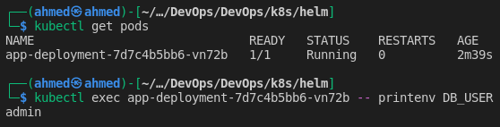

- A secret management tool like **Hashicorp Vault** is typically used in production to provide more control and security.

### 3.4. Resource Restrictions

- Create [`k8s/minikube/limitrange.yaml`](../k8s/minikube/limitrange.yaml) with request (min) and limit (max) cpu and memory usage for all containers.

- Apply configuration: `kubectl apply -f limitrange.yaml`

- Check configuration is being used:

  ```bash
  $ kubectl get pod/app-deployment-7d7c4b5bb6-vn72b -oyaml
  ...
  resources:
    limits:
      cpu: 500m
      memory: 128Mi
    requests:
      cpu: 500m
      memory: 128Mi
  ...
  ```

- The same is done using the helm chart (in `deployment.yaml` resources map).

### 3.5. Application Configuration

- Applications may need config files to operate. Create a dummy config for testing

  ```bash
  cd k8s/helm/app-deployment/
  mkdir files
  echo '{ "key": "value" }' > files/config.json
  ```

- Create [templates/configmap.yaml](../k8s/helm/app-deployment/templates/configmap.yaml) ConfigMap resource with the data from the JSON file.

- Edit [templates/deployment.yaml](../k8s/helm/app-deployment/templates/deployment.yaml) to mount `files/` directory as a volume in `/app/config` in the app container.

- Install the chart and verify the file is available in the container.

    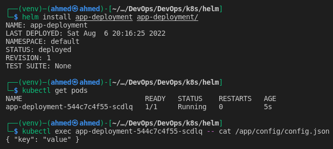

### 3.6. Managing Stateful Apps

- Add stateful logic to the applications. For Python App, I added:
  - `app.log` storing date and time for each `GET /` request.
  - `db/visits.json` storing the number of times `/` was accessed by user.
  - `/visits` endpoint returning the content of `visits.json`

- Create [statefulset.yaml](../k8s/helm/app-deployment/templates/statefulset.yaml) with a headless service, StatefulSet ([example](https://kubernetes.io/docs/concepts/workloads/controllers/statefulset/#components)), and a PVC template mounted at `/app/db`  

- Deploy or upgrade the chart:

  ```bash
  helm upgrade --install app-deployment app-deployment/ --values my_values.yaml
  ```

- Show created resources

  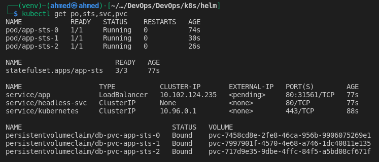

- Test the service

  ```bash
  # Get service address
  $ minikube service app --url
  http://192.168.49.2:31561
  
  # Create some traffic using Apache Bench
  # 114 requests, 5 requests at a time, 5 seconds before a request times out.
  $ ab -n 114 -s 5 -c 5 http://192.168.49.2:31561/
  ```

- Check `visits.json` in different pods

  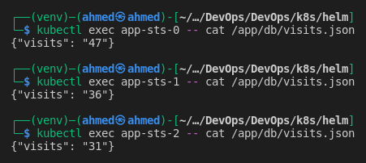

- For this application, ordering of pods is not needed, it slows down the startup and termination, this can be avoided by setting `podManagementPolicy` to `"Parallel"` in the StatefulSet spec.

#### **Behind the scenes**

- **For each pod in the StatefulSet, K8s will:**

  - Create a PersistentVolumeClaim from the specified `volumeClaimTemplates`

  - Dynamically provision a PersistentVolume at the following `hostPath` with the same properties as the PVC.

    ```bash
    /tmp/hostpath-provisioner/default/{volumeClaimTemplates.metadata.name}-{pod_name}
    ```

  - Statically bind each PVC with a corresponding PV using `volumeName` in the PVC and `claimRef` in the PV.

  - Add a volume each pod named `{volumeClaimTemplates.metadata.name}` which we already mounted on the pod using `volumeMounts`.

- **Concerns and Notes:**

  - **Security rists:** `hostPath` volumes should be avoided overall because they allow access to the host node which introduces security risks.
  - **No multi-node clusters:** this setup won’t work as expected when deployed on a cluster with multiple nodes, `local` volume types should be used instead of `hostPath` for this purpose.
  - **No persistence guarantees:** `visits.json` for each pod will maintain state between pod restarts, but all data will be lost when the StatefulSet is deleted for any reason.
  - **No consistency guarantees:** each pod will get its copy of the path on host and modify it separately, so accessing `/visits` on the web will give inconsistent results.
  - All the above issues are addressed in production by using a remote storage (outside of k8s cluster) such as `nfs` and managing data consistency in application logic (e.g., using master and slaves DB replicas where master is the only pod with write access).

### 3.7. Using Init-Containers

- Init containers run before the main containers in the pod, they can be used to do some initialization tasks.

- Create a pod ([`k8s/minikube/init-container.yaml`](../k8s/minikube/init-container.yaml)) that runs an init container to download a file, save it to a volume, and access it from the main container.

  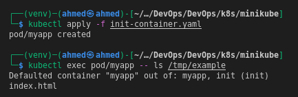

### 3.8. Deploying Community Charts

#### Install `kube-prometheus-stack` chart

```bash
# Add prometheus-community repo to helm
helm repo add prometheus-community https://prometheus-community.github.io/helm-charts

# Update chart index
helm repo update

# Install kube-prometheus-stack in the monitoring namespace.
# Creating the namespace if required
helm install monitoring prometheus-community/kube-prometheus-stack -n monitoring --create-namespace
```

#### **Default components deployed by the chart**

- **Prometheus**: the monitoring system scraping metrics from other components. The chart also deploys external related components:
  - **AlertManager**: system to send alerts based on certain rules (e.g., a scraped value for a certain metric exceeded a certain threshold).
  - **NodeExporter**: a daemonset running on all nodes and exporting a `/metrics` endpoint for scraping by Prometheus.
  - **Kube-state-metrics**: exports metrics about kubernetes itself.
- **Prometheus Operator**: k8s integration/plugin for Protmetheus, allows deploying custom resources (notably, `ServiceMonitor`, `PodMonitor`, and `PrometheusRule`) through CRDs.
- **Grafana**: the visualization web app with pre-created dashboards showing the metrics collected by Prometheus.

#### **Default resources created by the chart**

```bash
# Some of the resources deployed by the chart
$ kubectl get deployment,svc,sts,ds
deployment.apps/monitoring-grafana
deployment.apps/monitoring-kube-prometheus-operator
deployment.apps/monitoring-kube-state-metrics
service/alertmanager-operated
service/monitoring-grafana
service/monitoring-kube-prometheus-alertmanager
service/monitoring-kube-prometheus-operator
service/monitoring-kube-prometheus-prometheus
service/monitoring-kube-state-metrics
service/monitoring-prometheus-node-exporter
service/prometheus-operated
daemonset.apps/monitoring-prometheus-node-exporter
statefulset.apps/alertmanager-monitoring-kube-prometheus-alertmanager
statefulset.apps/prometheus-monitoring-kube-prometheus-prometheus

# Other resources (configmaps, secrets, serviceaccount, crds, ...) are not shown
```

#### **Accessing dashboards**

- For testing with minkube, metrics plugin should be added

  ```bash
  minikube addons enable metrics-server
  ```

- `kubectl port-forward svc/monitoring-grafana 80 -n monitoring`

- Access dashboards at <http://localhost/dashboards>, default creds: `admin:prom-operator`

#### Memory and CPU usage

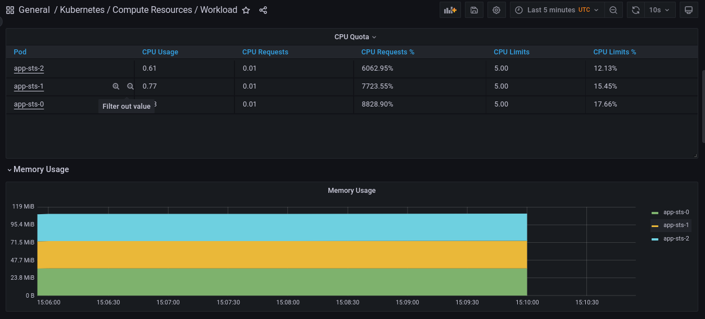

#### Node metrics

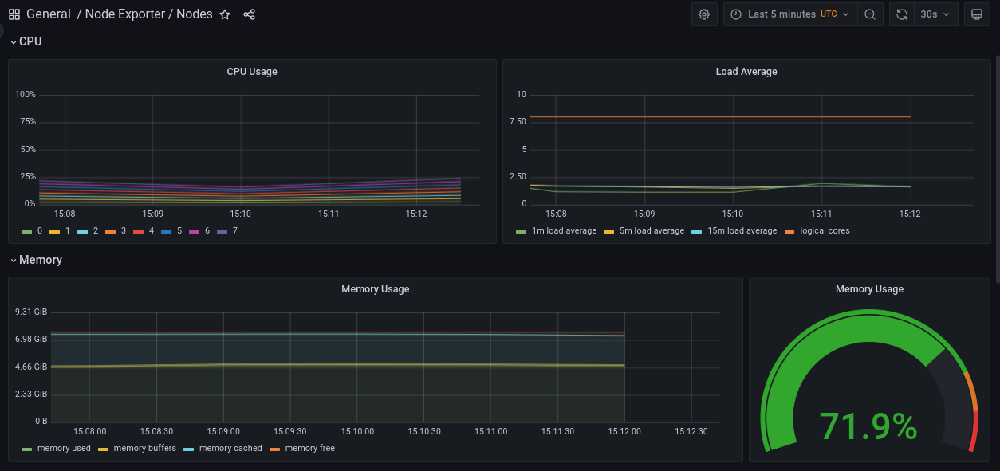

#### Kubelet

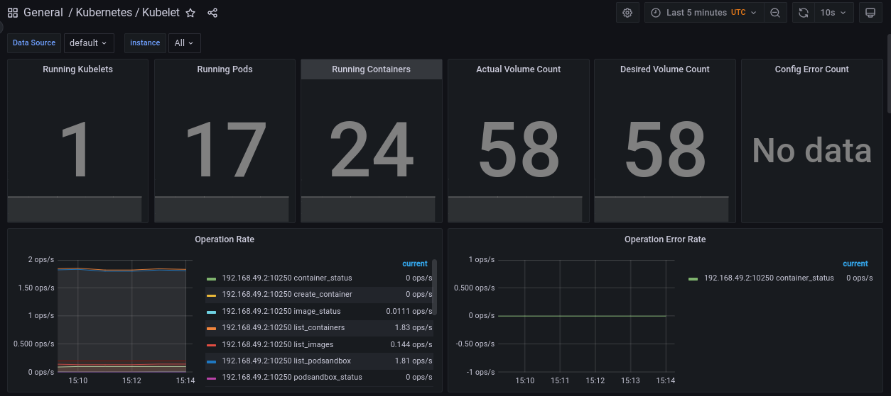

#### Pod Networking


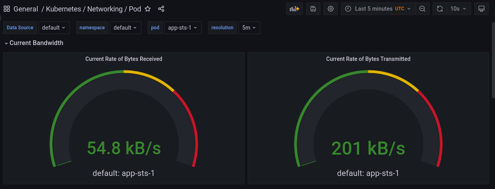

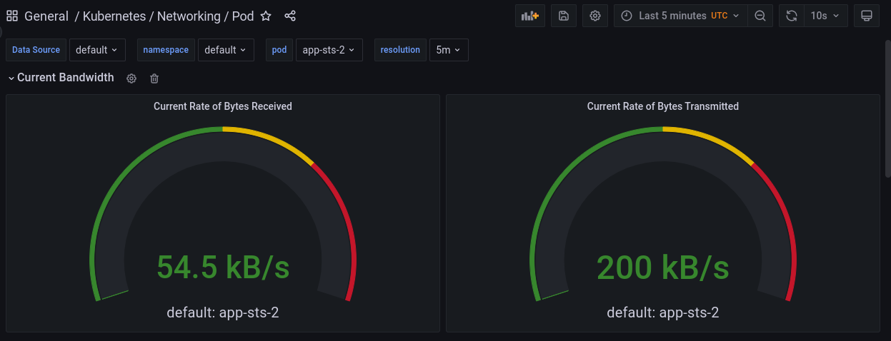

#### Alerts

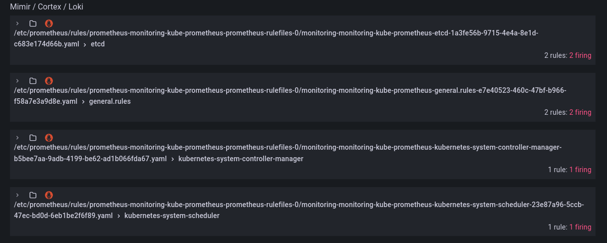

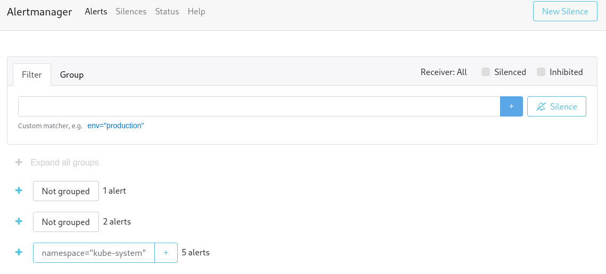

## 4. Best Practices

- <https://kubernetes.io/docs/setup/best-practices/>

- <https://helm.sh/docs/chart_best_practices/>
